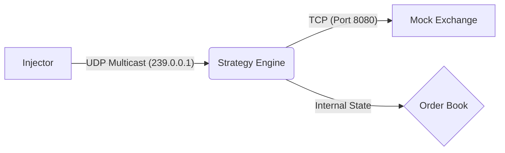

# High-Frequency Trading (HFT) Simulation Framework

A low-latency trading system simulation implemented in Modern C++ (C++17). This project simulates a complete trading loop—from parsing raw market data events to executing trades on a mock exchange—with a focus on **minimizing and measuring tick-to-trade latency**.

## 🚀 Key Features

- **Dual-Protocol Architecture:** Uses **UDP Multicast** for high-throughput market data feeds and **TCP** for reliable order execution.
- **Optimistic Execution:** The Strategy Engine implements "Optimistic Execution," immediately consuming liquidity from its internal Order Book upon sending an order to minimize perceived latency and prevent double-execution during high-speed replays.
- **Latency Benchmarking:** Built-in high-resolution instrumentation measures **Tick-to-Trade** latency in nanoseconds for every signal.
- **Idempotency & Arbitration:** The Order Book logic includes deduplication checks to handle multicast loopback echoes and redundant network feeds without data corruption.
- **Kernel Optimizations:** Built with `-O3` and configured with `TCP_NODELAY` (Nagle's Algorithm disabled) for immediate packet transmission.

## 🏗 Architecture

The system consists of three decoupled processes communicating over the local loopback network:



1. **Market Data Injector:** Replays historical market data logs (`.log`) and broadcasts them as binary UDP packets (`MarketUpdate` struct).
2. **Strategy Engine (The "Brain"):**
   - Listens to the UDP feed via a non-blocking socket loop.
   - Maintains a local **Order Book**.
   - Evaluates trading signals (Buy/Sell based on price thresholds).
   - Executes trades via a persistent TCP connection to the Exchange.
3. **Mock Exchange:** A TCP server that accepts `OrderRequest` packets and provides immediate `ExecutionReport` (auto-fill) responses.

## 🛠 Prerequisites

- **OS:** Linux (Ubuntu 20.04/22.04 LTS recommended)
- **Compiler:** GCC 9+ or Clang (Must support C++17)
- **Build System:** CMake 3.10+

## ⚡ Quick Start

### 1. Clone & Prepare Data

This repository does **not** include the large market data files. You must provide your own log file.

```bash
# 1. Clone the repo
git clone <repo_url>
cd HFT_Project

# 2. Add your Data File
# Place your 'SCH.log' file inside the 'data/' directory.
# The system expects the file at: ./data/SCH.log
ls data/
# Output should show: SCH.log
```

### 2. Compile

Use the provided build script to compile all three components in `Release` mode (with `-O3` optimizations enabled).

```bash
chmod +x build.sh
./build.sh
```

### 3. Run Simulation

The `run.sh` script orchestrates the entire simulation. It launches the Exchange and Strategy in the background, waits for initialization, and then fires the Injector.

```bash
chmod +x run.sh
./run.sh
```

To stop the simulation early, press `Ctrl+C`. The script handles cleanup and kills all background processes automatically.

## 📊 Performance Metrics

The Strategy Engine outputs latency metrics to `stdout` for analysis. Note that logging happens *after* the critical trade path to avoid blocking I/O penalties.

```text
>>> BUY @ 107.77 (ID: 1) | Latency: 4200 ns
>>> SELL @ 106.50 (ID: 2) | Latency: 3800 ns
```

- **Latency Definition:** The time delta between the **start of packet processing** (Tick) and the **completion of the socket write** (Trade).
- **Typical Performance:** ~3–6 microseconds (µs) on virtualized hardware with `-O3` optimization.

## 🧠 Design Decisions

### Why `std::map` for the Order Book?

For this implementation, `std::map` was chosen for code clarity and simplicity in handling sparse price levels. In a production HFT environment dealing with dense order books, this would be replaced with a **pre-allocated flat array (vector)** indexed by price ticks to improve cache locality and achieve $O(1)$ lookups.

### Optimistic Execution vs. Real Execution

The simulation uses "Optimistic Execution," meaning the strategy decrements available liquidity from its internal book *immediately* upon sending an order, rather than waiting for the Exchange's confirmation. This allows the strategy to accurately simulate walking the book (buying multiple price levels) in a high-speed replay environment where the data feed doesn't react to our trades.

### Network Stack

- **Multicast Loopback:** Explicitly handled via software-level deduplication (Idempotency checks in `OrderBook.h`) rather than OS-level filtering. This ensures the system is robust against redundant network feeds (Arbitration).
- **Thread Isolation:** Market data processing happens in a dedicated thread to ensure the main application loop remains responsive.

## 🔮 Future Work

- Replace `std::map` with flat arrays for cache-efficient $O(1)$ lookups.
- Explore kernel bypass (e.g., DPDK) for ultra-low latency packet handling.
- Implement multi-threaded order matching and risk checks.
- Add support for multiple instruments and cross-asset strategies.

---
